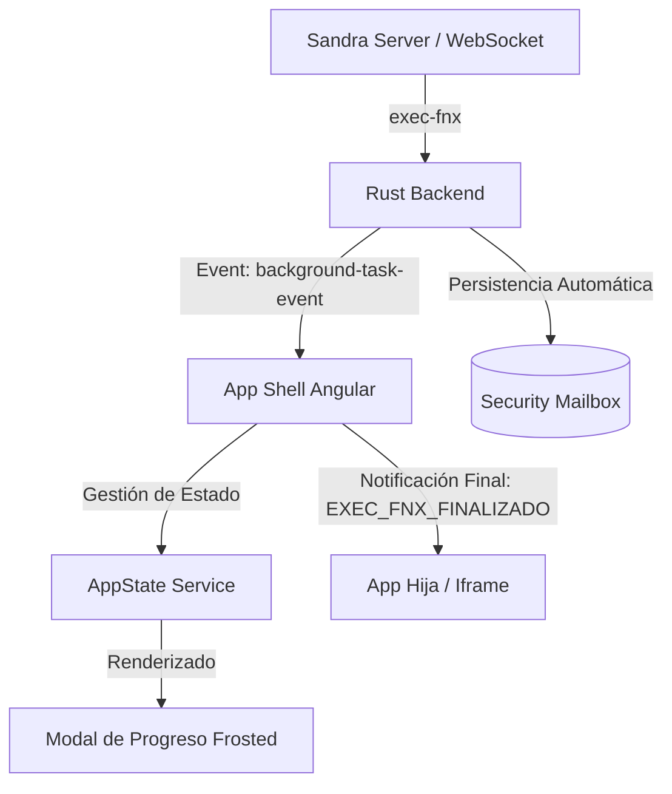

# Sandra Desktop Container (SDC)

### Plataforma de Orquestación Segura para Aplicaciones Distribuidas

**Sandra Desktop Container (SDC)** es una arquitectura de software de grado militar diseñada para la gestión, orquestación y ejecución segura de micro-aplicaciones de escritorio. Construida sobre la robustez de **Rust** y la versatilidad de **Angular**, SDC redefine el concepto de "contenedor de aplicaciones" al proporcionar un entorno aislado, cifrado y de alto rendimiento que actúa como un sistema operativo de capa superior (Layer-7 OS).

---

## Visión Técnica y Futuro

SDC no es simplemente un lanzador de aplicaciones; es un **Orquestador de Entornos Seguros**. Su propósito es abstraer la complejidad del sistema operativo subyacente (macOS, Linux, Windows) para ofrecer una interfaz unificada, segura y controlada donde las aplicaciones empresariales críticas pueden ejecutarse sin interferencias externas.

El futuro de SDC apunta hacia la **Computación Descentralizada y Privada**, donde el contenedor gestiona no solo la ejecución de la UI, sino también la identidad soberana del usuario, las llaves criptográficas y la persistencia de datos local-first, eliminando la dependencia absoluta de la nube para operaciones sensibles.

---

## Stack Tecnológico

La arquitectura de SDC combina lo mejor del rendimiento nativo y la flexibilidad web:

### (Core) - Rust & Tauri 2.0

- **Seguridad de Memoria**: El backend está escrito íntegramente en **Rust**, garantizando la ausencia de errores de segmentación y condiciones de carrera, cumpliendo con los estándares más altos de robustez (Memory Safety).
- **Runtime Asíncrono**: Utiliza `tokio` para manejar miles de conexiones WebSocket concurrentes con latencia cercana a cero.
- **IPC Seguro**: La comunicación entre la UI y el Sistema Operativo se realiza a través de un puente IPC (Inter-Process Communication) aislado, impidiendo la inyección de código arbitrario.

### Interfaz (Frontend) - Angular (Standalone Architecture)

- **Diseño Modular**: Arquitectura basada en Componentes Standalone (Signals, Observables) para una reactividad instantánea.
- **Gestión de Estado**: Servicios reactivos (`SdcService`, `AppStateService`) que sincronizan la telemetría del sistema en tiempo real.
- **Estética UX/UI**: Sistema de diseño "Sandra Teal Soft", enfocado en la reducción de carga cognitiva mediante paletas pastel y tipografía inter.

---

## Estándares de Seguridad y Normativas ISO

SDC ha sido diseñado siguiendo rigurosamente principios de **Seguridad por Diseño (Security by Design)**, alineándose con normativas internacionales:

### 1. Cifrado y Protección de Datos (ISO/IEC 27001)

Cumplimos con los controles de criptografía de la norma ISO 27001 para asegurar la confidencialidad e integridad:

- **En Reposo**: Base de Dtos **SQLite Cipher** con cifrado **AES-256-GCM**. Ningún dato persiste en disco en texto plano.
- **En Tránsito**: Comunicaciones obligatorias sobre **TLS 1.3** y **WSS (WebSocket Secure)**, rechazando conexiones degradadas o inseguras.
- **Hashing**: Uso de **Argon2** para el derivado y verificación de credenciales, resistente a ataques de fuerza bruta y GPU/ASIC.

### 2. Aislamiento y Control de Módulos (ISO/IEC 27034)

- **Aislamiento (Sandboxing)**: Cada micro-aplicación se ejecuta en un contexto `iframe` controlado con políticas de seguridad de contenido (CSP) estrictas, evitando el Cross-Site Scripting (XSS) entre módulos. SDC implementa una arquitectura de **Micro-Frontends Aislados** mediante un esquema de protocolo personalizado (`sandra-app://`).
- **Trazabilidad**: El **Inspector SDC** integrado ofrece un registro inmutable de eventos (Log, Red, Sistema) que permite auditorías forenses precisas sin comprometer la privacidad (los logs de vista se limpian de la memoria de sesión sin afectar la persistencia legal en BD).

### 3. Gobernanza y Gestión de TI (COBIT 2019)

SDC integra marcos de gobernanza para asegurar que la tecnología soporte los objetivos de seguridad institucional:

- **APO12 (Gestión de Riesgos)**: Identificación proactiva de amenazas mediante telemetría de bajo nivel y monitoreo de procesos.
- **DSS05 (Servicios de Seguridad)**: Protección contra malware y control de acceso basado en identidad soberana y dispositivos confiables.
- **BAI06 (Gestión de Cambios)**: El sistema de actualizaciones atómicas garantiza la integridad de la cadena de suministro de software.

### 4. Ciberseguridad y Resiliencia (ISO/IEC 27032)

Implementamos directrices para la protección de activos en el ciberespacio:

- **Resiliencia Operativa**: Capacidad de recuperación ante fallos mediante el aislamiento de hilos en Rust.
- **Defensa en Profundidad**: Múltiples capas de validación desde el kernel de Rust hasta la sanitización de la UI en Angular.

---

## Protocolo de Gobernanza y Trazabilidad "Alquimia Invisible" (SDC-AI)

### 1. Resumen Ejecutivo
La estrategia **Alquimia Invisible** implementa una capa de esteganografía digital de alta fidelidad. Utilizando técnicas de inyección de metadatos y caracteres de ancho cero (Zero-Width Characters), el sistema inyecta sellos de trazabilidad que son imperceptibles para el ojo humano y para procesadores de texto estándar, pero completamente verificables por el núcleo de seguridad de SandraDC.

### 2. Marco Normativo y Estándares Internacionales
El desarrollo de esta tecnología se rige por las siguientes normativas de protección de la información:

- **ISO/IEC 27001:2022 (Gestión de Seguridad de la Información)**:
    - *Control A.8.25 (Cifrado)*: Cumple con el requisito de proteger la confidencialidad e integridad de la información mediante técnicas criptográficas y de ocultación (Steganography).
    - *Control A.8.33 (Eliminación de información)*: Asegura que los metadatos de trazabilidad no interfieran con la utilidad o el propósito primario del archivo.
- **ISO/IEC 24760-1:2019 (Gestión de Identidad y Trazabilidad)**:
    - Establece el soporte para el **No Repudiable**. Al inyectar la firma del nodo (MAC) y del usuario (JWT) de forma invisible, el sistema garantiza que el origen de un archivo sea rastreable hasta el emisor original.
- **Estándar Unicode (U+200C, U+200D, U+FEFF, U+200B)**:
    - La implementación respeta el estándar internacional Unicode, asegurando interoperabilidad de datos sin corromper el parsing de sistemas externos.

### 3. Estrategias de Inyección por Arquitectura de Archivo

#### A. Alquimia para Documentos Estructurados (PDF)
Para archivos PDF, SandraDC utiliza la técnica de **Metadata Object Injection**:
- **Target**: Diccionario `Info` del Trailer del PDF.
- **Metodología**: Utilizando la librería `lopdf` en Rust, se inyecta una semilla criptográfica bajo la clave personalizada `SDC-Seal`.
- **Efecto**: El sello reside en la estructura de objetos del PDF. Es invisible al lector (Viewer), no aparece en el texto del documento, pero es detectable mediante inspección de objetos binarios.

#### B. Alquimia Esteganográfica para Texto Plano (CSV, TXT, LOG)
Para archivos de flujo secuencial, se utiliza la técnica de **Zero-Width Bit Encoding**:
- **Metodología**: El sello de texto se convierte en una secuencia de bits. Cada bit se mapea a un carácter Unicode invisible:
    - **Bit 1**: `U+200D` (Zero Width Joiner)
    - **Bit 0**: `U+200C` (Zero Width Non-Joiner)
- **Encapsulamiento**: La cadena de bits se rodea de marcadores de control:
    - `U+FEFF` (Marcador de Inicio / BOM)
    - `U+200B` (Marcador de Fin / Zero Width Space)
- **Efecto**: La firma se adjunta al final del stream de bytes. Es **100% invisible** en editores de texto, hojas de cálculo o navegadores, sin alterar la estructura de filas o columnas del archivo.

### 4. Especificaciones de Seguridad (Propiedades de la Capa)

- **Integridad (Hashing)**: El sello inyectado incluye un Hash derivado de la identidad del usuario y del terminal. Cualquier intento de modificar el sello sin las llaves del contenedor invalidará la secuencia de bits detectada por el validador en Rust.
- **Resistencia a la Detección (Stealth)**: Al evitar caracteres ASCII extendidos o saltos de línea adicionales, la firma sobrevive a procesos comunes de transferencia de archivos y copiado/pegado en sistemas que soporten codificación UTF-8.
- **No Repudiación Global**: Cada archivo generado por SandraDC lleva la "huella digital" del terminal origen, impidiendo que un usuario niegue la autoría o exportación de datos sensibles.

### 5. Guía de Auditoría Forense Digital
Para auditores que necesiten validar la firma sin herramientas SandraDC:

**Método Hexadecimal (Referencia Cruzada):**
1. Buscar el marcador de inicio: `EF BB BF` (Hex).
2. Patrón de datos: Secuencias repetitivas de `E2 80 8C` (0) y `E2 80 8D` (1).
3. Marcador de fin: `E2 80 8B`.

**Comando Bash de Auditoría:**
```bash
# Extraer los últimos 1000 bytes y buscar el preámbulo de la Alquimia Invisible
tail -c 1000 [archivo_analizar] | xxd -p | grep "efbbbf"
```

---

## Fundamentos Científicos y Técnicos

La seguridad de SDC no es solo una configuración, es un **Principio Matemático**:

### Seguridad de Memoria (Deterministic Resource Management)

Rust elimina clases enteras de vulnerabilidades (CWE-119, CWE-416) mediante su sistema de **Ownership** y el **Borrow Checker**. Esto garantiza científicamente la ausencia de fugas de memoria y condiciones de carrera, permitiendo ejecuciones deterministas y seguras.

### Criptografía Probabilística (AES-256-GCM)

Utilizamos **AES (Advanced Encryption Standard)** con una longitud de clave de 256 bits, configurado en modo **Galois/Counter Mode (GCM)**.

- **Confidencialidad e Integridad**: GCM proporciona cifrado autenticado que impide ataques de manipulación de ciphertext (bit-flipping).
- **Entropía Segura**: Generación de Nonces de 96-bits para cada operación, asegurando que la misma entrada nunca genere la misma salida cifrada.

### Derivación de Claves de Alta Resistencia (Argon2id)

Para la protección de credenciales, empleamos **Argon2id**, el ganador de la Password Hashing Competition. Su diseño científico equilibra la resistencia contra ataques de GPU (costo de memoria) y ataques de canal lateral (ejecución constante de tiempo).

---

## Cumplimiento Legal y Hacking Ético

SDC opera bajo un marco estricto de **Hacking Ético y Legalidad Informática**:

1. **Principio de Mínimo Privilegio (PoLP)**: Las micro-aplicaciones carecen de acceso al sistema de archivos o redes externas a menos que sea explícitamente autorizado mediante el puente IPC seguro.
2. **Interceptación Lícita y Auditoría**: El Inspector de Red actúa como herramienta de transparencia, permitiendo a los oficiales de seguridad auditar el tráfico saliente sin recurrir a técnicas de "Man-in-the-Middle" externas.
3. **Privacidad por Diseño (GDPR / LOPD)**: Implementación de cifrado estructural que garantiza que los datos sensibles solo sean legibles por el receptor autorizado, cumpliendo con leyes internacionales de protección de datos personales.
4. **Respeto a la Propiedad Intelectual**: El contenedor protege los activos digitales (PDFs, Bases de Datos) contra la copia no autorizada mediante sistemas de protección estructural (SSE - Sandra Secure Encryption).

---

## Capacidades del Contenedor

### Inspector y Depuración en Tiempo Real

Una herramienta de ingeniería inversa integrada que permite:

- Interceptación pasiva de peticiones de red (Fetch/XHR) de aplicaciones de terceros.
- Visualización de logs de sistema y de aplicaciones satélite.
- **Gestión de Sesión en Memoria**: Capacidad de limpiar la vista del operador (`sessionLogs Map`) sin destruir la evidencia forense almacenada en la base de datos segura.

### Telemetría y Monitorización

El módulo **Monitor** utiliza `sysinfo` para extraer métricas de bajo nivel (CPU, RAM, Red) y presentarlas visualmente, permitiendo al operador tomar decisiones basadas en el estado real del hardware.

### Sistema de Actualizaciones Atómicas y Virtualización de Puente

SDC puede descargar, instalar y actualizar micro-aplicaciones (`sandra-app://`) desde repositorios remotos seguros. Además, cuenta con un **Motor de Parcheo en Caliente** que inyecta capas de seguridad en aplicaciones legacy al vuelo (corrección de WebSockets, normalización de protocolos y bypass seguro de CORS).

### Beneficios del Ecosistema SDC

- **Neutralidad del Hardware**: Ejecuta aplicaciones complejas en cualquier sistema con overhead mínimo.
- **Bunker Digital**: El contenedor actúa como un perímetro de seguridad que rodea a la aplicación.
- **Identidad Granular**: Cada acción está vinculada a un SID (Secure ID) trazable.

---

## Gestión de Tareas en Segundo Plano y Notificaciones (exec-fnx)

SDC implementa un sistema avanzado para el seguimiento de tareas asíncronas de larga duración iniciadas por aplicaciones hijas o el sistema central. Este sistema garantiza la visibilidad del proceso sin interrumpir el flujo de trabajo del operador.

### 1. Arquitectura de Comunicación y Flujo
El sistema utiliza un puente híbrido entre WebSockets (comunicación externa) y eventos Tauri (comunicación interna):



### 2. Componentes del Sistema

-   **Backend (Rust)**: El orquestador en Rust procesa los mensajes de tipo `exec-fnx`. Al detectar la finalización de una tarea, inyecta automáticamente un registro en el **Buzón de Seguridad (Mailbox)**, asegurando que el detalle completo (payload y metadatos) sea auditable históricamente.
-   **Frontend UI (Angular)**: Un componente flotante con diseño de **Cristal Esmerilado (Glassmorphism)** proporciona feedback visual en tiempo real. Utiliza micro-animaciones para indicar el progreso y el estado final (Éxito/Error).
-   **Notificación a Apps Hijas**: Al completar la ejecución, el Shell utiliza `MessagePorts` para enviar el evento `EXEC_FNX_FINALIZADO` junto con el detalle recolectado directamente al contexto de la aplicación que originó la petición.

---

## Instalación y Desarrollo

```bash
# Instalar dependencias del frontend
npm install

# Ejecutar en modo desarrollo (Hot Reload)
npm run tauri dev

# Compilar para producción (Release optimizado)
npm run tauri build
```

---

> _"En un mundo de software efímero, Sandra Desktop Container establece un estándar de permanencia, seguridad y control."_
