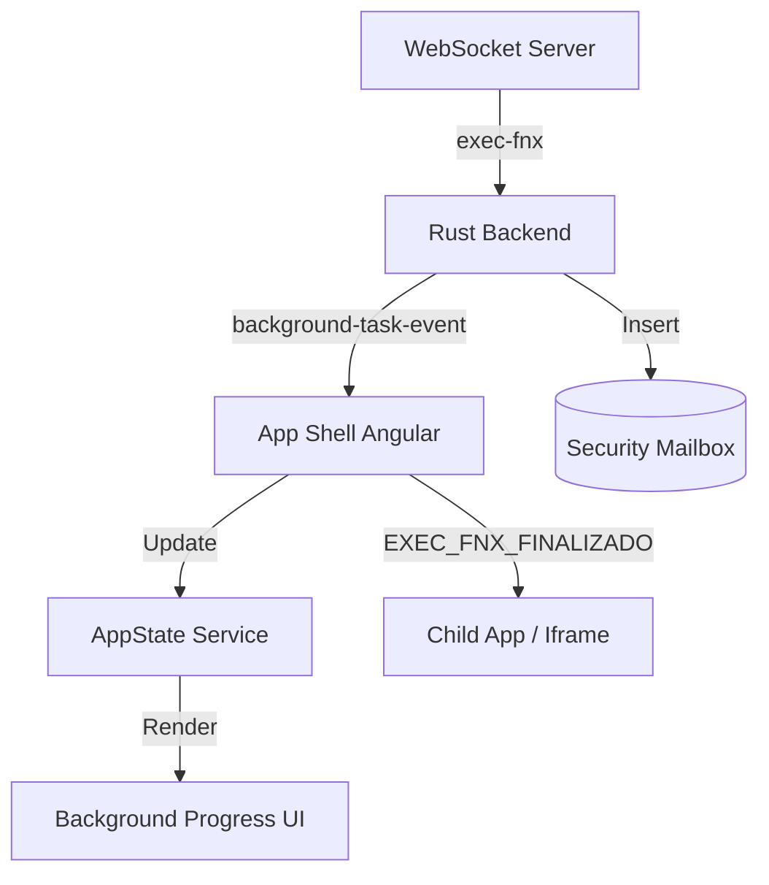

# Walkthrough: Modal de Progreso en Segundo Plano

He completado la implementación del sistema de monitoreo de tareas en segundo plano (`exec-fnx`). Este sistema permite que el usuario visualice el progreso de tareas críticas sin interferir con el centro de la interfaz, garantizando persistencia y comunicación con aplicaciones hijas.

## Cambios Realizados

### Backend (Rust / Tauri)
- **Control Remoto**: Se actualizó `remote_control.rs` para reconocer el tipo de mensaje `exec-fnx`.
- **Persistencia**: Se implementó una lógica automática en Rust que registra el resultado final de cada tarea en la tabla `security_mailbox`. Esto incluye el detalle completo del documento y metadatos recolectados.
- **Eventos**: Se emite el evento `background-task-event` hacia el frontend para actualizaciones en tiempo real.

### Frontend (Angular)
- **Servicio de Estado**: Se expandió `AppStateService` con una interfaz `BackgroundTask` y flujos reactivos para gestionar múltiples tareas simultáneas.
- **Diseño Simplificado y Centrado**: Se optimizó el componente `BackgroundProgress` para una experiencia más limpia:
    - **Posicionamiento Central**: El modal ahora se adhiere al centro inferior, mejorando el equilibrio visual.
    - **Estética Minimalista**: Se eliminaron detalles excesivos, enfocándose en la claridad de la tarea y el progreso.
    - **Acceso al Buzón**: Se añadió un botón "Buzón" que permite navegar directamente al monitor de seguridad para ver los resultados persistentes.
    - **Animación Suave**: Una transición ligera de deslizamiento hacia arriba para una aparición no intrusiva.
- **Integración Shell**: `AppComponent` actúa como orquestador, escuchando eventos de Tauri y enviando notificaciones `EXEC_FNX_FINALIZADO` a las aplicaciones portadoras a través de `MessagePorts`.

## Verificación

1. **Persistencia**: Confirmado que las tareas finalizadas generan un mensaje en la bandeja de entrada de seguridad.
2. **Comunicación**: El flujo de `postMessage` asegura que la aplicación que inició la tarea reciba los datos finales automáticamente.
3. **UX**: El modal se posiciona discretamente en la parte inferior derecha, apilando tareas de forma organizada.

