# Plan de Sincronización SDC (Arquitectura Unificada en Rust)

Este documento detalla la arquitectura de sincronización de correos electrónicos, ahora consolidada íntegramente en el backend de Rust para garantizar autonomía y robustez.

## 1. Objetivos del Sistema
- **Autonomía**: El comando de Rust gestiona el ciclo completo (Manifiesto -> Descarga -> ACK).
- **Eficiencia de Red**: Uso de **NDJSON Streaming** para el manifiesto y para la confirmación masiva (ACK).
- **Feedback en Tiempo Real**: Emisión de eventos Tauri durante cada fase del stream para actualizar la UI.
- **Seguridad**: Autenticación persistente y validación de contexto en cada segmento del flujo.

## 2. Modelo de Secuencia (Mermaid)

```mermaid
sequenceDiagram
    participant Go as Sandra Server (Go)
    participant Rust as SDC Core (Rust)
    participant LDB as Local SQLite
    participant UI as Angular UI

    Note over Go,Rust: WebSocket Keep-alive
    Go->>Rust: Message {type: "sdc_sync"}
    Rust->>UI: Emit "refresh-mailbox" (Trigger)
    
    rect rgb(30, 30, 40)
    Note over UI,Rust: Fase 1: Descarga por Streaming (NDJSON)
    UI->>Rust: sync_mailbox()
    Rust->>LDB: Get last_mailbox_sync cursor
    Rust->>Go: GET /sdc/manifest?cursor=T1&format=ndjson
    loop Procesando NDJSON Chunks
        Rust->>Rust: Check SID existence
        Note right of Rust: Si es nuevo:
        Rust->>Go: GET /sdc/message/GUID
        Rust->>LDB: INSERT INTO security_mailbox
        Rust->>UI: Emit "sync-item-received"
    end
    end

    rect rgb(40, 40, 30)
    Note over Rust,Go: Fase 2: ACK por Streaming (NDJSON)
    Rust->>Go: POST /sdc/ack (NDJSON Stream)
    loop Confirmaciones
        Go-->>Rust: Chunk: {guid: "G1", status: "Delivered"}
        Rust->>UI: Emit "sync-ack-confirmed"
    end
    Rust-->>UI: Return [AllProcessedGUIDs]
    end
    
    Rust->>UI: Emit "refresh-mailbox" (Final)
```

## 3. Implementación Técnica
- **`api_get_raw_request` / `api_post_raw_request`**: Helpers en Rust que devuelven el stream de respuesta (`reqwest::Response`).
- **`sync_mailbox` (`security.rs`)**: Implementa bucles `while let Some(chunk) = res.chunk().await` para procesar NDJSON línea por línea.
- **Tauri Events**: Se utilizan `sync-item-received` y `sync-ack-confirmed` para mantener la UI informada sin necesidad de que Angular coordine la red.
